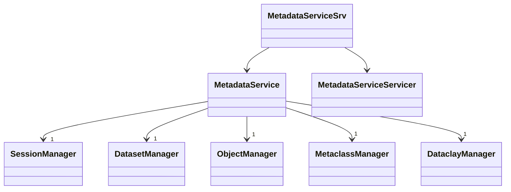

```mermaid
classDiagram


    %% Server
    MetadataServiceSrv --> MetadataService
    MetadataServiceSrv --> MetadataServiceServicer


    %% Managers
    MetadataService --> "1" SessionManager
    MetadataService --> "1" DatasetManager
    MetadataService --> "1" ObjectManager
    MetadataService --> "1" MetaclassManager
    MetadataService --> "1" DataclayManager

    class MetadataService{
    }

    link MetadataServiceSrv "setup.py" "This is a tooltip for a link"

```